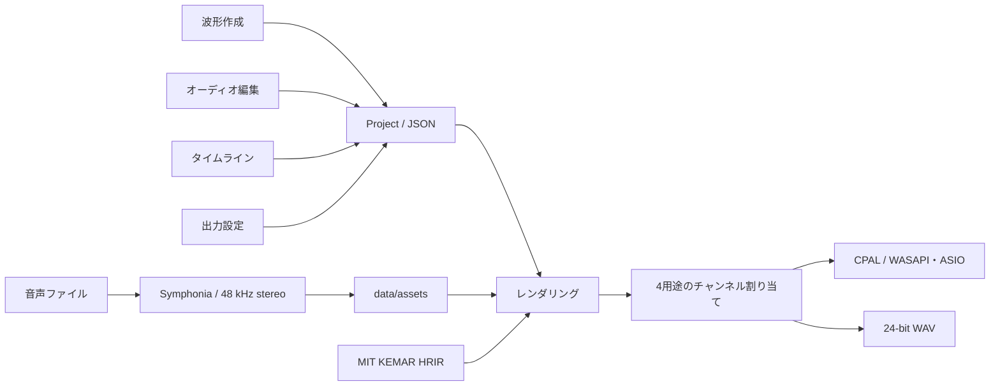

# AirCueの構成

AirCueは、空気砲の短い駆動波形とイヤホン用の音声を作成し、ひとつのタイムラインで再生するWindowsアプリです。編集画面は同じTauriウィンドウ内で切り替えます。

## 担当ファイル

| ファイル | 役割 |
|---|---|
| `web/app.js` | 画面切り替え、波形作成、空気砲タイムライン、出力設定 |
| `web/auditory.js` | 音声取り込みUI、テスト音、オーディオトラック |
| `web/spatial.js` | プリセット、経路の補間と通過点の追加 |
| `web/spatial-editor.js` | 音源位置の図、通過点、確認スライダー |
| `src/unity_export.rs` | Unity用音声・メタデータ・Importerの書き出し |
| `src/experiment.rs` | ローカル実験プロトコル、刺激準備、試行記録 |
| `unity/Runtime`・`unity/Editor` | UnityのPrefab生成、PCM取り込み、再生 |
| `src/main.rs` | Tauriコマンド、永続化、ファイルダイアログ、書き出し |
| `src/model.rs` | 空気砲波形、標準波形、プロジェクト検証、駆動波形の合成 |
| `src/auditory.rs` | 音声デコード、素材管理、テスト音、HRTF畳み込み、混合タイムライン |
| `src/audio.rs` | デバイス列挙、ストリーム、互換出力、再生中のバッファ差し替え |

## データと出力

- 空気砲の素材には左・右を持たせません。80 ms以内の共通素材を左右の別トラックに配置します。
- 音声素材はファイル内容のSHA-256で識別し、取り込み時にコピーします。クリップは素材ID、切り出し範囲、レベル、定位設定を持ちます。
- オーディオは立体音響オフならステレオを保持し、オンなら単一音源としてHRTFを適用します。
- 48 kHzで合成し、イヤホン左・右／空気砲左・右を4つの論理用途として扱います。物理chは出力設定で入れ替えます。
- 2ch出力では選択した種類だけを再生します。音声と空気砲の同時再生には4chを使用します。
- 保存時にプロジェクト全体を検証し、一時ファイルから置換します。直前のJSONをバックアップします。
- 音声を含む持ち運び用プロジェクトは `.aircue` と同名の `.media/assets` の組です。
- 再生・書き出しはデジタルピークを検証します。実測音圧、風速、体感強度とは別の値です。

## 今後の拡張点

立体音響の実装仕様は [SPATIAL_AUDIO.md](SPATIAL_AUDIO.md) にまとめています。v0.3.0で位置・高さ・距離のキーフレーム経路、8種類の定位プリセット、経路の視覚確認を実装しました。

Unityへの完成音響・タイミングの書き出しはv0.4.0で実装しています。[Unity連携設計](UNITY_INTEGRATION.md) を参照してください。実測による校正、空気流のモデル、個人化HRTFは未実装です。

Unityを試行管理、AirCueを4ch再生に使うローカル実験連携はv0.5.0で実装しています。[実験同期設計](EXPERIMENT_SYNC.md) を参照してください。

## 配布

`.github/workflows/windows.yml` がWindows上でテスト、インストーラー作成、対応ソースの梱包を行います。タグとアプリのバージョンが一致し、ビルドが成功した場合だけReleaseジョブに進みます。通常ビルドには読み取り権限、Releaseジョブにのみ書き込み権限を付与しています。
